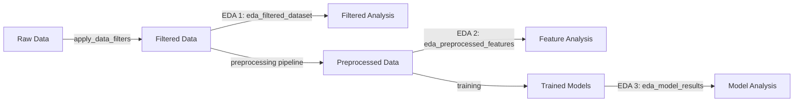

# 📊 PROPOSTA: Nuovo EDA Allineato al Progetto

**Problema**: Gli EDA attuali analizzano il dataset raw completo, ma il modello usa:
- ✅ Filtri: anno >= 2022, zone escluse (E1/E2/E3/R1), no ville
- ✅ Feature pruning: ~56 colonne droppate
- ✅ Feature contestuali: aggiunte dopo split
- ✅ Trasformazione target: Yeo-Johnson

**Soluzione**: Rifare EDA che rifletta il dataset **EFFETTIVAMENTE usato dal modello**.

---

## 🎯 STRUTTURA PROPOSTA

### Notebook 1: `eda_filtered_dataset.ipynb`

**Obiettivo**: Analizzare il dataset POST-FILTRI (prima del preprocessing)

**Contenuto**:
```python
# 1. Load config e applica filtri (come fa la pipeline)
config = load_config('config/config.yaml')
df = pd.read_parquet('data/raw/raw.parquet')
df = apply_data_filters(df, config)  # Usa funzione del progetto!

# 2. Overview dataset filtrato
- Dimensioni finali (righe × colonne)
- Confronto con dataset originale (quanti dati rimossi?)
- Distribuzione temporale (solo 2022+)
- Distribuzione zone (senza E1/E2/E3/R1)
- Distribuzione tipologie (senza ville)

# 3. Target analysis (scala originale)
- Statistiche descrittive
- Distribuzione (histogram + KDE)
- Outlier detection (IQR, Z-score, Isolation Forest) - stesso metodo della pipeline
- Distribuzione per zona
- Distribuzione per tipologia
- Distribuzione per categoria catastale

# 4. Feature analysis PRE-PREPROCESSING
- Missing values (prima dell'imputation)
- Correlazioni con target (top 30)
- Correlazioni tra feature (identificare ridondanze)
- Heatmap correlazioni (solo feature non droppate)

# 5. Split temporale analysis
- Distribuzione train/val/test per anno-mese
- Statistiche target per split (verifica drift)
- Feature drift tra split

# 6. Analisi zone post-filtro
- Prezzi medi per zona
- Volumi per zona
- CV (variabilità) per zona
- Zone più/meno rappresentate
```

**Output**:
```
notebooks/eda_filtered_outputs/
├── dataset_comparison.csv          # Raw vs Filtered
├── target_statistics_filtered.csv
├── target_distribution_filtered.png
├── outliers_analysis.csv
├── split_statistics.csv
├── zone_analysis_filtered.csv
├── correlations_filtered.csv
├── correlation_heatmap_filtered.png
└── temporal_distribution.png
```

---

### Notebook 2: `eda_preprocessed_features.ipynb`

**Obiettivo**: Analizzare feature **DOPO preprocessing** (come le vede il modello)

**Contenuto**:
```python
# 1. Load preprocessed data (da data/preprocessed/)
X_train_tree = pd.read_parquet('data/preprocessed/X_train_tree.parquet')
X_train_catboost = pd.read_parquet('data/preprocessed/X_train_catboost.parquet')
y_train = pd.read_parquet('data/preprocessed/y_train_tree.parquet')

# 2. Feature inventory
- Quante feature finali per profilo (tree vs catboost)
- Feature categoriche preservate (catboost)
- Feature encoded (tree)
- Feature contestuali aggiunte (con nome: zone_*, type_*, temporal_*)

# 3. Target transformation analysis
- Distribuzione target originale vs trasformato (Yeo-Johnson)
- Lambda fitted
- Skewness/Kurtosis prima e dopo
- Q-Q plot per verificare normalità

# 4. Feature importance (da preprocessing)
- Correlazioni con target TRASFORMATO
- Top 20 feature più correlate
- Feature contestuali: quanto contribuiscono?

# 5. Encoding analysis
- Target encoding: statistiche per categoria
- Frequency encoding: distribuzione frequenze
- Ordinal encoding: mapping categorie

# 6. Numeric features analysis
- Distribuzione dopo winsorization (se abilitata)
- Distribuzione dopo scaling (profilo scaled)
- Outlier finali nel train set

# 7. Categorical features (profilo catboost)
- Cardinalità per feature categorica
- Categorie più frequenti
- Categorie rare (< 1%)
```

**Output**:
```
notebooks/eda_preprocessed_outputs/
├── feature_inventory.csv           # Lista completa feature per profilo
├── target_transformation.png       # Before/After Yeo-Johnson
├── correlations_transformed.csv    # Con target trasformato
├── contextual_features_impact.csv  # Contributo feature contestuali
├── encoding_statistics.csv
├── categorical_distribution.csv    # Solo profilo catboost
└── numeric_distributions.png
```

---

### Notebook 3: `eda_model_results.ipynb`

**Obiettivo**: Analizzare risultati dei modelli trained

**Contenuto**:
```python
# 1. Load models e predictions (da models/)
summary = json.load('models/summary.json')
best_model = # ... load best model

# 2. Performance overview
- Metriche per modello (R², RMSE, MAE, MAPE)
- Ranking modelli
- Performance ensemble vs singoli modelli
- Confronto train vs validation vs test (overfit check)

# 3. Predictions analysis
- Scatter plot: predicted vs actual
- Residual plot
- Residual distribution (should be normal)
- Q-Q plot residuals

# 4. Error analysis per gruppo
- MAPE per zona OMI
- MAPE per tipologia
- MAPE per categoria catastale
- MAPE per price band (quantili)

# 5. Worst predictions
- Top 50 worst predictions
- Pattern comuni?
- Zone problematiche?
- Range di prezzo problematico?

# 6. Feature importance (SHAP)
- Top 20 feature più importanti
- SHAP summary plot
- SHAP dependence plot (top 5 feature)
- Feature contestuali: quanto pesano?

# 7. Prediction intervals (se abilitati)
- Coverage analysis (80%, 90%)
- Average width per price band
- Calibration plot
- Uncertainty vs error
```

**Output**:
```
notebooks/eda_model_outputs/
├── model_comparison.csv
├── predictions_vs_actual.png
├── residual_analysis.png
├── error_by_zone.csv
├── error_by_typology.csv
├── worst_predictions.csv
├── shap_importance.png
├── shap_dependence_top5.png
└── prediction_intervals_analysis.png
```

---

## 🔄 WORKFLOW PROPOSTO



---

## 📋 CHECKLIST IMPLEMENTAZIONE

### Step 1: Cleanup (SUBITO)
```bash
# Backup vecchi EDA (opzionale)
mkdir -p notebooks/old_eda_backup
mv notebooks/eda_basic.ipynb notebooks/old_eda_backup/
mv notebooks/eda_advanced.ipynb notebooks/old_eda_backup/
mv notebooks/eda_outputs notebooks/old_eda_backup/
mv notebooks/eda_comprehensive_outputs notebooks/old_eda_backup/

# O cancellazione diretta
rm notebooks/eda_basic.ipynb notebooks/eda_advanced.ipynb
rm -rf notebooks/eda_outputs notebooks/eda_comprehensive_outputs
```

### Step 2: Setup (PREPARAZIONE)
```bash
# Crea nuove directory
mkdir -p notebooks/eda_filtered_outputs
mkdir -p notebooks/eda_preprocessed_outputs
mkdir -p notebooks/eda_model_outputs

# Crea nuovi notebook vuoti
touch notebooks/eda_filtered_dataset.ipynb
touch notebooks/eda_preprocessed_features.ipynb
touch notebooks/eda_model_results.ipynb
```

### Step 3: Implementazione

**Priorità ALTA** (essenziali):
- ✅ `eda_filtered_dataset.ipynb` → Analisi dataset post-filtri
- ✅ `eda_model_results.ipynb` → Analisi risultati modelli

**Priorità MEDIA** (utili):
- ⚠️ `eda_preprocessed_features.ipynb` → Analisi feature preprocessing

### Step 4: Update README
```markdown
# notebooks/README.md

## 📊 EDA Notebooks (Allineati al Progetto)

### 1. eda_filtered_dataset.ipynb
Analisi dataset POST-FILTRI (anno>=2022, zone escluse, no ville)
- Output: `eda_filtered_outputs/`

### 2. eda_preprocessed_features.ipynb
Analisi feature dopo preprocessing (encoding, target transform, contestuali)
- Output: `eda_preprocessed_outputs/`

### 3. eda_model_results.ipynb
Analisi risultati modelli (performance, SHAP, error analysis)
- Output: `eda_model_outputs/`
```

---

## 🎯 VANTAGGI NUOVO EDA

### ✅ Allineamento
- Analizza **esattamente** i dati usati dal modello
- Riflette filtri, preprocessing, feature engineering
- Nessuna discrepancy tra EDA e training

### ✅ Riproducibilità
- Usa funzioni del progetto (`apply_data_filters`, `apply_target_transform`)
- Stesso config del training (`config.yaml`)
- Nessun codice duplicato

### ✅ Interpretabilità
- Capire perché il modello performa come performa
- Identificare pattern nei dati filtrati
- Validare scelte di preprocessing

### ✅ Debug
- Verificare che preprocessing sia corretto
- Identificare feature problematiche
- Analizzare outlier residui

---

## 📝 TEMPLATE STARTER

```python
# eda_filtered_dataset.ipynb - Template

import sys
from pathlib import Path
sys.path.insert(0, str(Path.cwd().parent / "src"))

import pandas as pd
import numpy as np
import matplotlib.pyplot as plt
import seaborn as sns

from utils.config import load_config
from preprocessing.pipeline import apply_data_filters
from utils.logger import get_logger

logger = get_logger(__name__)

# =============================================================================
# CONFIGURATION
# =============================================================================

CONFIG_PATH = "../config/config.yaml"
RAW_DATA_PATH = "../data/raw/raw.parquet"
OUTPUT_DIR = Path("eda_filtered_outputs")
OUTPUT_DIR.mkdir(exist_ok=True)

# =============================================================================
# LOAD & FILTER DATA
# =============================================================================

config = load_config(CONFIG_PATH)
df_raw = pd.read_parquet(RAW_DATA_PATH)

print(f"Dataset raw: {len(df_raw):,} righe × {len(df_raw.columns)} colonne")

# Applica STESSI filtri della pipeline
df = apply_data_filters(df_raw, config)

print(f"Dataset filtrato: {len(df):,} righe × {len(df.columns)} colonne")
print(f"Rimossi: {len(df_raw) - len(df):,} righe ({(len(df_raw)-len(df))/len(df_raw)*100:.1f}%)")

# =============================================================================
# ANALYSIS
# =============================================================================

# ... il tuo codice di analisi qui ...
```

---

## 🚀 AZIONE IMMEDIATA

Vuoi che:

1. **Cancelli** i vecchi EDA e crei la struttura nuova? (backup prima)
2. **Creo template** per i 3 nuovi notebook con codice starter?
3. **Implemento** il notebook prioritario (`eda_filtered_dataset.ipynb`) completo?

**Raccomandazione**: Fai backup, poi implementa step-by-step iniziando da `eda_filtered_dataset.ipynb`.

```bash
# Quick start
mkdir -p notebooks/old_eda_backup
mv notebooks/eda_*.ipynb notebooks/old_eda_backup/
mv notebooks/eda_*_outputs notebooks/old_eda_backup/

# Pronto per nuovo EDA allineato al progetto!
```
